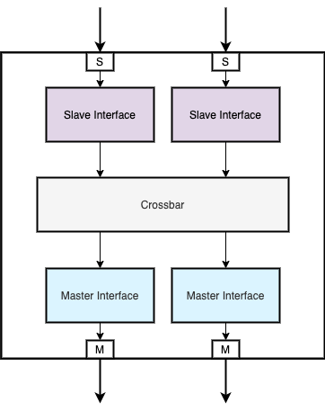

# AXI Crossbar

## Overview

An AXI4 crossbar implemented in SystemVerilog to build the foundation of a SOC.

A crossbar is a circuit connecting multiple master and slave agents, mapped
across a memory space. The core consists of a collection of switches, routing
the master requests to the slaves and driving back completions to the agents.
A crossbar is common piece of logic to connect for instance in a SOC the
processor(s) with the peripherals like memories, IOs, coprocessors...

  <!--img width="100" height="100" src=""-->
  

Features

- Number of master and slave agents configurable
- Master/slave buffering capability, configurable per interface
    - Outstanding request number configurable
    - Request payload configurable per interface (AXI3 vs AXI4 vs AXI4-lite seamless support)
- CDC support in master & slave interface. Convert an interface's clock domain
  from/to the crossbar inner clock domain
- Round-robin arbitration
    - Non-blocking arbitration between requesters
    - Priority configurable per master interface
- Timeout support per AXI channel & per interface
    - A shared counter implement a time reference
    - A request timeout leads the completion to response with DECERR
    - A completion timeout leads the completion to response with SLVERR
- Switching logic IO interfaces can be pipelined to achieve timing closure easier
- Full-STRB vs Partial-STRB mode
    - Partial-STRB mode stores only first and last phase of a write request's payload STRBs,
      all other dataphases are fully activated (WSTRBs=1)
    - Full-STRB mode transports the complete STRBs dataphases as driven by a master
    - Useful to save gate count
- USER signal support
    - Configurable for each channel (AW, AR, W, B, R)
    - Common to all master/slave interfaces if activated
- AXI or AXI4-Lite mode:
    - LITE mode: route all signals described in AXI4-lite specification
    - FULL mode: route all signals described by AXI4 specification
    - The mode applies to global infrastructure
- Master routes to a slave can be defined to restrict slave access
    - Permits to create enclosed and secured memory map
    - Access a forbidden memory zone returns a DECERR reponse in completion channel
    - Useful to save gate count

## Implementation Details

- All interfaces share the same address / data / ID width
    - Address width configurable, any width
    - Data width configurable, any width
    - ID width configurable, any width
- Route read/write requests by address decoding. All slave agents are mapped
  into the memory space with a start/end address range.
- Route read & write completion by ID decoding. All master agents have an ID
  mask used to identified the route to drive back a completion

## Development plan

Limitations (current dev stage)

- AW & W channels need to be ready at the same cycle
- No timeout support
- 4x4 master/slave interfaces
- LITE mode only (AXI4 mode should work, just not tested yet)
- No master priority setup
- Full-STRB mode only
- No xUSER signals support

Inbox

- Address translation service
- Top level generator to adapt the core to the users need
- Number of master/slave configurable, wider than 8x8
- Completion reordering in case of out-of-order response
- Interface datapath width conversion
- AXI4/AXI4-lite converter
- Read-only or Write-only master to save gate count
- 4KB boundary crossing checking
