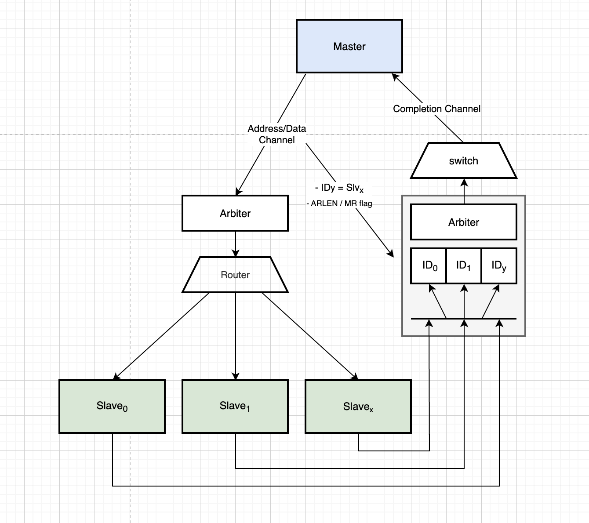

# Strict Ordering Rules Support

## Overview

AXI4 specifies strict ordering rules per transaction ID:

- Write responses (B channel) must be returned in-order per ID
- Read responses (R channel) must be returned in-order per ID

The initial crossbar implementation did not guarantee these constraints in the following scenario:

- A master issues multiple transactions using the same ID
- Transactions target different slaves
- Slaves have different response latencies

This could result in out-of-order responses for the same ID, violating AXI4 requirements.

This development will enforce a strict ordering rule per AXI ID.

The ordering enforcement introduces constraints:

- If a slave response is delayed, subsequent responses for the same ID are blocked
- This can create backpressure toward:
  - Slave interfaces
  - Internal crossbar datapaths

## Architecture

Each slave switch will now embbed a FIFO per ID, as much FIFO than outstanding request
supported, with a depth equals to the the number of outstanding request supported.
The FIFO will store:
- the slave index targeted
- the misrouted flag
- the burst length, only for read completion

While each master is identified by its unique ID Mask, the number of FIFO could be huge. Indeed,
the user must extend the ID width and these extra bits would widely increase the possible ORs.
So the slave switch slave will always decode/remove the mask to instance a minimum number of FIFOs.

The switch will no more support completion interleaving, i.e. a read completion will be
now completely routed-back the master until RLAST assertion. This feature is not so usefull
and may be complicated to support for a master.

To select the ID to route back the master, a round-robin is included.

  <!--img width="100" height="100" src=""-->
  

## Verification

- Use the existing testbench driving randomized request, based on SVUT.
- Unleash master driver to issue multiple consecutive outstanding requets with the same ID, still
  with a pseudo-random way. A master could issue multiple different IDs or multiple times the
  same ID. Queues will be extended to be able to store as much outstanding requests per ID the
  crossbar can per slave interface.
